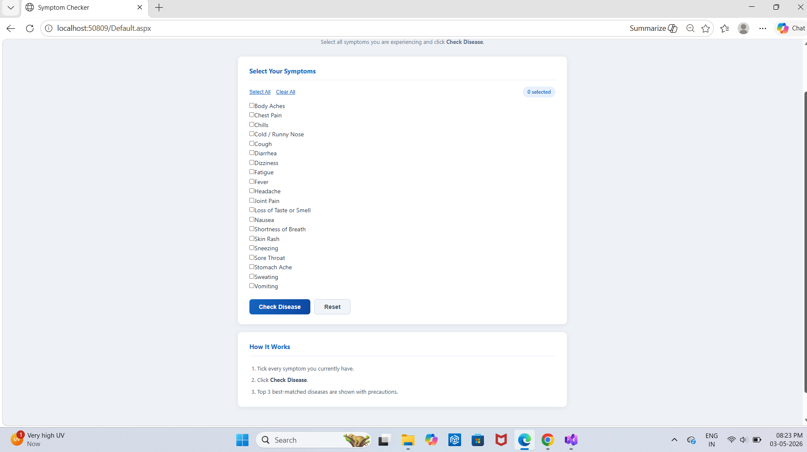

# Symptom Checker App

This is an offline Symptom Checker web application built using ASP.NET and SQL Server.

## Features
- Select symptoms
- Get possible diseases
- Simple UI

## Technologies Used
- ASP.NET (Web Forms)
- C#
- SQL Server

## How to Run
1. Open in Visual Studio
2. Connect database
3. Run the project

##Output

